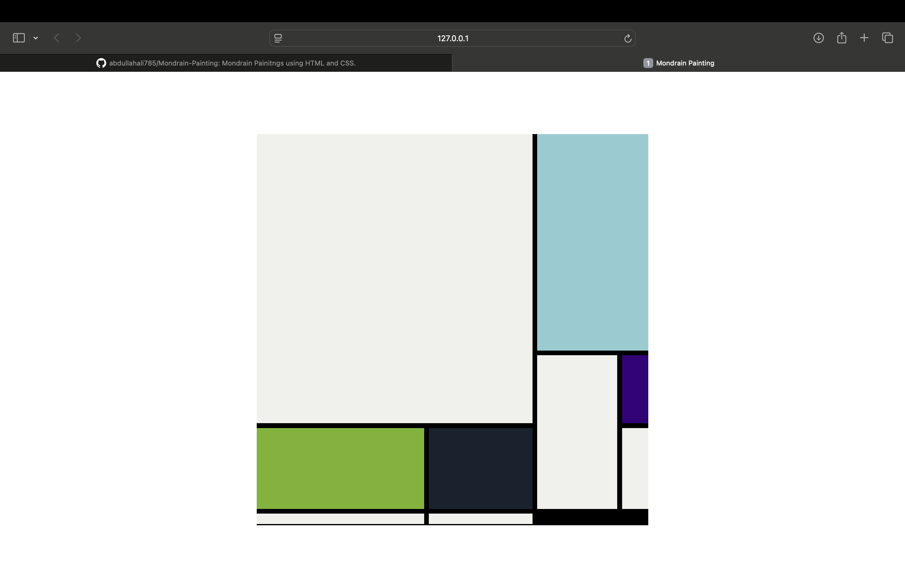
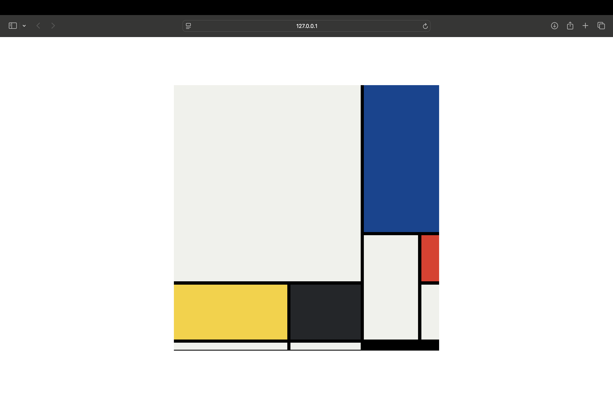

# 🎨 Mondrian CSS Art

This project is a creative tribute to the abstract artwork of **Piet Mondrian**, built entirely using **HTML** and **CSS**. It features two distinct paintings that replicate the iconic grid-based, primary-color style Mondrian is known for, all without using any images or JavaScript.

---

## 🖼️ Preview

### Painting 1

### Painting 2

---

## ✨ Features

- ✅ Pure HTML and CSS — no images, no JavaScript
- ✅ Clean and minimalist code
- ✅ Responsive layout using **CSS Grid**
- ✅ Two original compositions inspired by Mondrian's style

---
